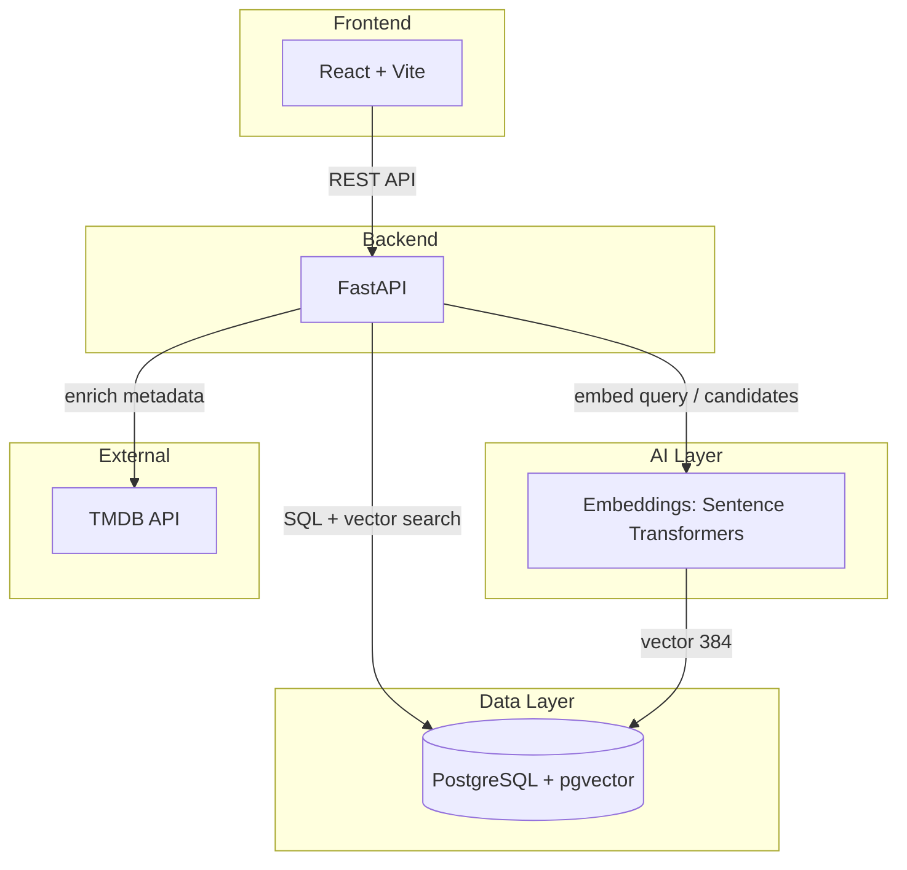

# 📺 MoodFlix

**AI-powered TV show recommendations** based on mood, preferences, and natural-language search. A full-stack demo of production-like architecture: FastAPI, React, PostgreSQL + pgvector, semantic search, and TMDB ingestion.

---

## Project Overview

MoodFlix helps users find TV shows quickly by combining:

- **Mood-based recommendations** – Chill, Adrenaline, Curious, etc.
- **Constraint filtering** – Age, binge preference, episode length, genres, watching context
- **Semantic search** – Natural-language queries (e.g. "cozy mystery with a twist")
- **Per-user watchlists** – Save and manage shows (JWT auth)

The system supports both **authenticated** and **guest** flows. Guests get a limited landing page with quick mood buttons and text search; authenticated users get the full recommendation form, semantic search, and watchlist.

---

## Key Features

| Feature | Description |
|---------|-------------|
| **Recommendations** | `POST /recommend` – Top N shows ranked by mood, genres, binge preference, episode length |
| **Semantic search** | `POST /search/semantic` – Vector similarity over show embeddings (pgvector) |
| **More like this** | `POST /search/more-like-this` – Similar shows by `show_id` |
| **Auth** | `POST /auth/register`, `POST /auth/login`, `GET /auth/me` – JWT |
| **Watchlist** | `GET /watchlist`, `POST /watchlist/add`, `POST /watchlist/remove` (JWT required) |
| **TMDB enrichment** | Optional write-through cache for posters, ratings, overviews |
| **Guest flow** | Quick mood buttons (Chill, Adrenaline, Curious) + text search on landing page |

---

## System Architecture



### Component Overview

| Component | Role |
|-----------|------|
| **Frontend (React)** | User interface, auth state, recommendation form, guest landing, watchlist |
| **Backend API (FastAPI)** | REST endpoints, auth, recommendation logic, semantic search, watchlist, TMDB enrichment |
| **Database (PostgreSQL + pgvector)** | Users, shows, watchlist items, vector embeddings (384-dim) |
| **Embeddings pipeline** | `scripts/generate_embeddings.py` – Local sentence-transformers, batch writes to `shows.embedding` |
| **TMDB ingestion** | `scripts/ingest_tmdb.py` – Seeds `shows` from TMDB (requires `TMDB_API_KEY`) |

**Flow:** User interacts with React → calls FastAPI → queries Postgres (with pgvector for semantic search) and optionally uses TMDB for metadata enrichment. Embeddings are generated offline and stored in the DB.

---

## Tech Stack

| Layer | Technologies |
|-------|---------------|
| **Backend** | FastAPI, SQLAlchemy, Alembic |
| **Database** | PostgreSQL (Docker), pgvector |
| **Frontend** | React, Vite |
| **Auth** | JWT (Bearer tokens) |
| **AI** | sentence-transformers (all-MiniLM-L6-v2), pgvector |

---

## Recommendation Engine Overview

### Data sources

| Condition | Source | Behavior |
|-----------|--------|----------|
| DB has **≥ 50 shows** | PostgreSQL `shows` table | DB-backed recommendations |
| DB has **< 50 shows** (or empty) | Static catalog (`app/data.py`) | Fallback ensures a sufficient candidate pool |

### Pipeline stages

1. **Candidate selection** – With `query`: semantic search over embeddings. Without `query`: full DB load (or static fallback if under-seeded).
2. **Filtering** – Hard filters: age/content rating, kids/family safety, binge preference, episode length, language, genre match (when user selects genres).
3. **Scoring** – Mood boost, genre match, binge preference, episode length, rating, vote count. Mood is **not** a hard filter; it affects ranking only.
4. **Ranking** – Sort by score, take top N.
5. **TMDB enrichment** – Optional metadata (posters, ratings, overviews) persisted to DB.
6. **Guest mood diversity** – Only for guest mood buttons: frontend applies a lightweight genre-overlap diversification pass (skip shows with 2+ shared genres to already-selected items) before displaying 5 results.

---

## Semantic Search Overview

- **Embeddings** – `sentence-transformers/all-MiniLM-L6-v2` produces 384‑dim vectors per show (title + genres + overview).
- **Vector similarity** – Cosine distance in pgvector via `ORDER BY embedding <=> query_vector`.
- **Storage** – `shows.embedding` column (`vector(384)`), HNSW index with `vector_cosine_ops` for fast approximate search.
- **Usage** – `POST /search/semantic` and `POST /recommend` (when `query` is provided) use semantic search for candidate retrieval.

### Generate embeddings

```powershell
python scripts/generate_embeddings.py
# Optional: --limit N, --force, --batch-size 50
```

---

## Project Structure

```
app/                  # FastAPI app, routers, business logic
  api.py              # FastAPI app + routes
  logic.py            # Recommendation engine (DB-backed + fallback)
  models.py           # SQLAlchemy models (User, WatchlistItem, Show)
  schemas.py          # Pydantic schemas (API contracts)
  embeddings.py       # Embedding logic (sentence-transformers)
  tmdb.py             # TMDB enrichment adapter (optional)

alembic/              # DB migrations
scripts/              # ingest_tmdb.py, generate_embeddings.py
frontend/             # React + Vite UI
docs/                 # Setup, database, planning, troubleshooting
tests/                # pytest (backend), Vitest (frontend)
```

---

## Local Setup Instructions

### Prerequisites

- Python 3.12.x
- Node.js
- Docker (for PostgreSQL + pgvector)

### 1. Start database

```powershell
docker compose up -d db
alembic upgrade head
```

### 2. Configure environment

```powershell
Copy-Item .env.example .env
```

Edit `.env`:

- `POSTGRES_*` or `DATABASE_URL` – Database connection
- `SECRET_KEY` – JWT signing
- `TMDB_API_KEY` – Optional; required for seeding and TMDB enrichment

### 3. Backend

```powershell
python -m venv venv
.\venv\Scripts\Activate.ps1
pip install -r requirements.txt
uvicorn app.api:app --reload
```

- API: `http://127.0.0.1:8000`
- Swagger: `http://127.0.0.1:8000/docs`

### 4. Frontend

```powershell
cd frontend
npm install
npm run dev
```

- App: `http://localhost:5173`

### 5. Seed (optional)

For DB-backed recommendations:

```powershell
python -m scripts.ingest_tmdb
python -m scripts.generate_embeddings
```
(Requires `TMDB_API_KEY` in `.env` for the ingest script. Run from project root.)

See [docs/setup.md](docs/setup.md) for detailed Windows setup.

---

## Running the Project

| Command | Purpose |
|---------|---------|
| `uvicorn app.api:app --reload` | Backend (from repo root) |
| `cd frontend && npm run dev` | Frontend |
| `docker compose up -d db` | Database |

---

## Testing

```powershell
# Backend
pytest

# Frontend
cd frontend && npm test
```

---

## Future Improvements

| Area | Ideas |
|------|-------|
| **Explainability** | LLM-based explanations for recommendations |
| **Natural language** | Richer query parsing beyond semantic search |
| **Feedback** | Like/dislike learning for re-ranking |
| **Infrastructure** | Redis caching, background workers for ingestion |
| **Observability** | Metrics, tracing, dashboards |

---

## Documentation

| File | Purpose |
|-----|---------|
| [docs/setup.md](docs/setup.md) | Step-by-step Windows setup |
| [docs/database.md](docs/database.md) | Migrations, seeding, reset |
| [docs/PLANNING.md](docs/PLANNING.md) | Project goals & roadmap |
| [docs/recommendation-single-result-investigation.md](docs/recommendation-single-result-investigation.md) | Troubleshooting single-result issues |
